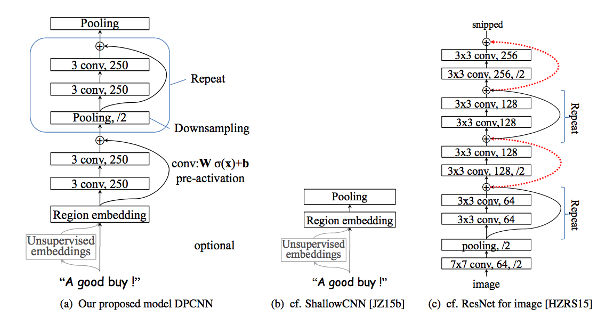
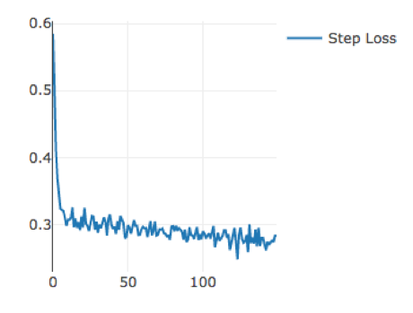
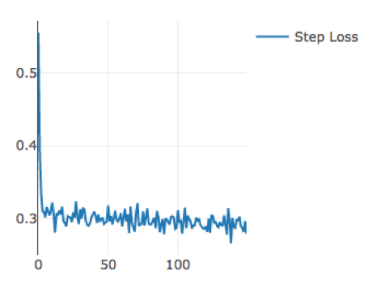
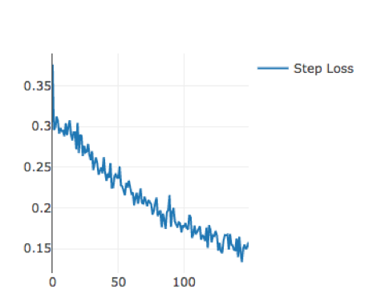

# Deep Pyramid Convolutional Neural Networks for Text Categorization

> This is a simple version of the paper *Deep Pyramid Convolutional Neural Networks for Text Categorization*.





You should rewrite the Dataset class in the data/dataset.py  
and put your data in '/data/train' or any other directory.

run by

```
python main.py --lr=0.001 --epoch=20 --batch_size=64 --gpu=0 --seed=0 --label_num=2			
```

## Evaluation 
> 	I run the model in a dataset about AD identify.  
	And make a comparition between the TextCNN, LSTM and our DPCNN. 
	 
Loss of **TextCNN** and **LSTM**.  
   


Loss of **DPCNN**.  


